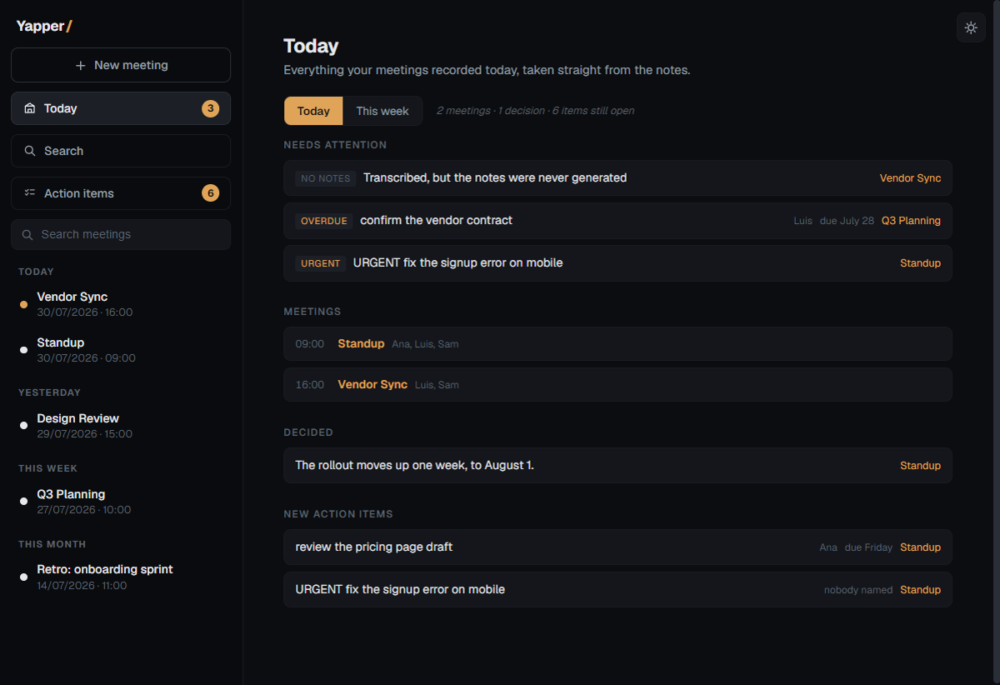
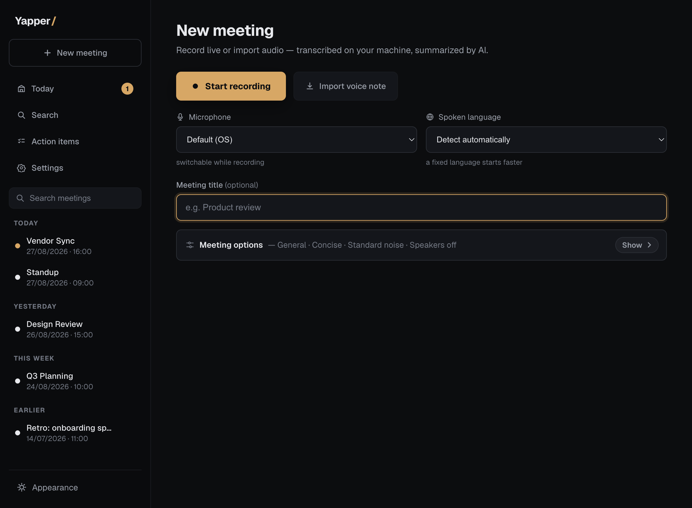
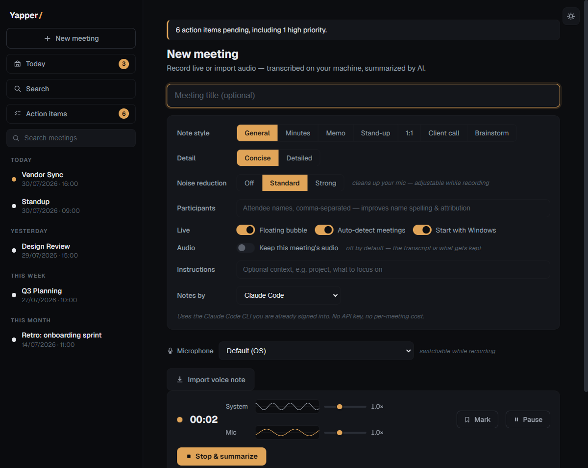
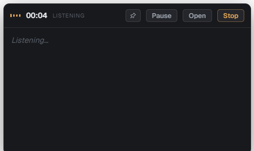
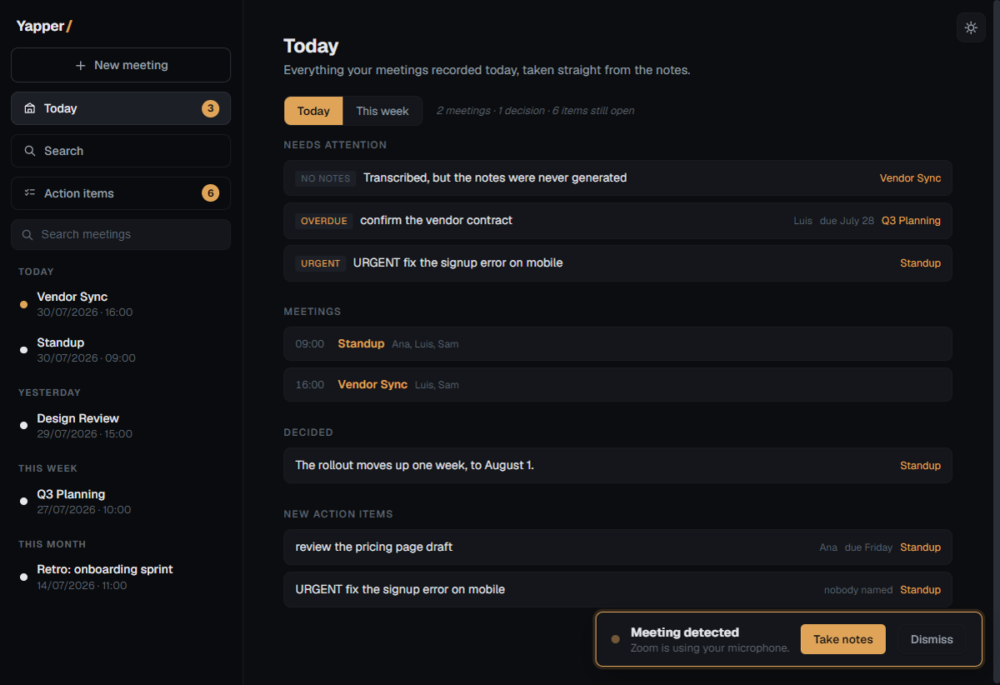
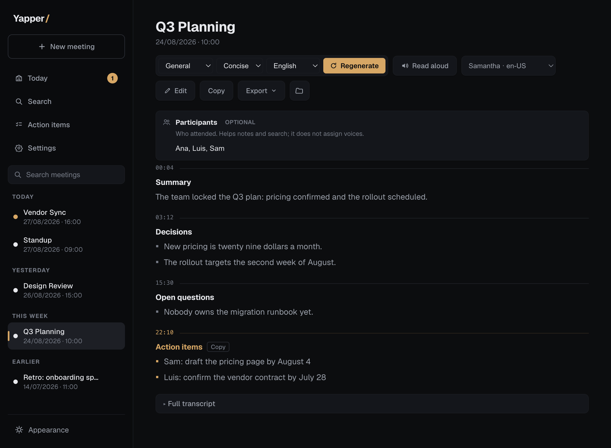
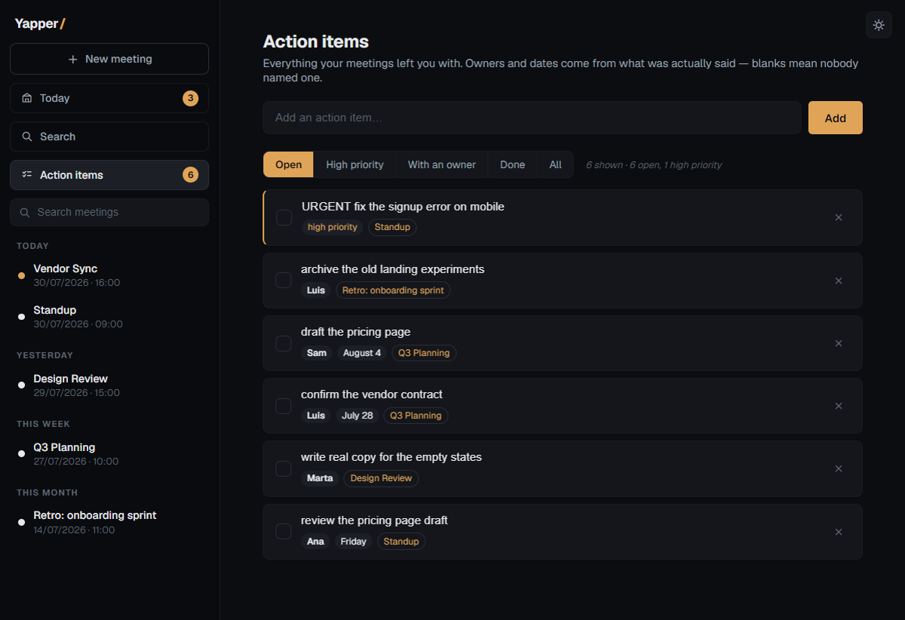
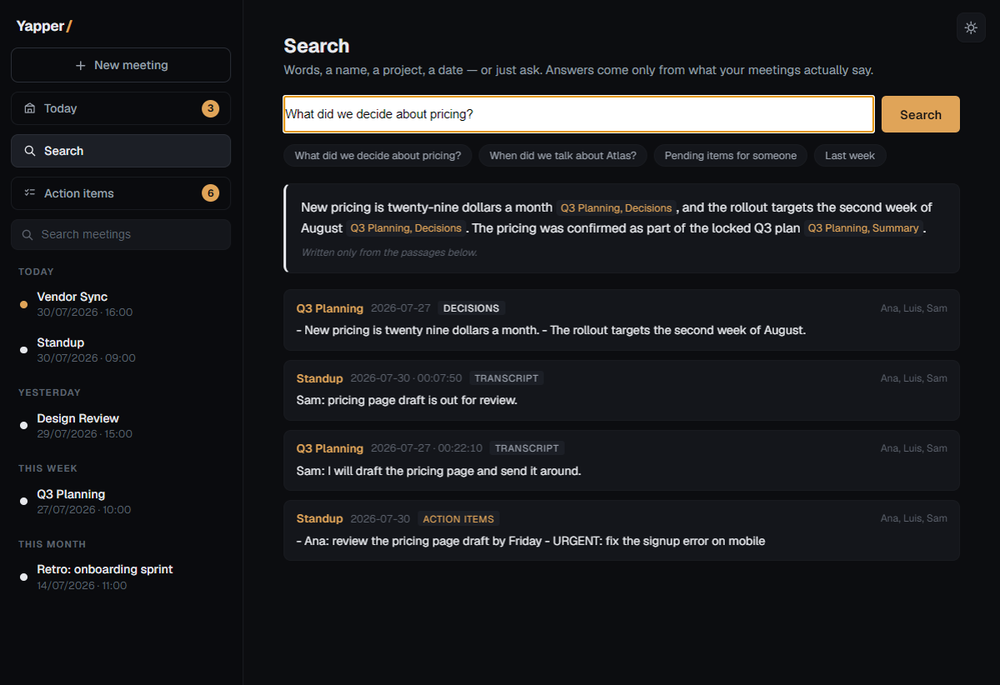
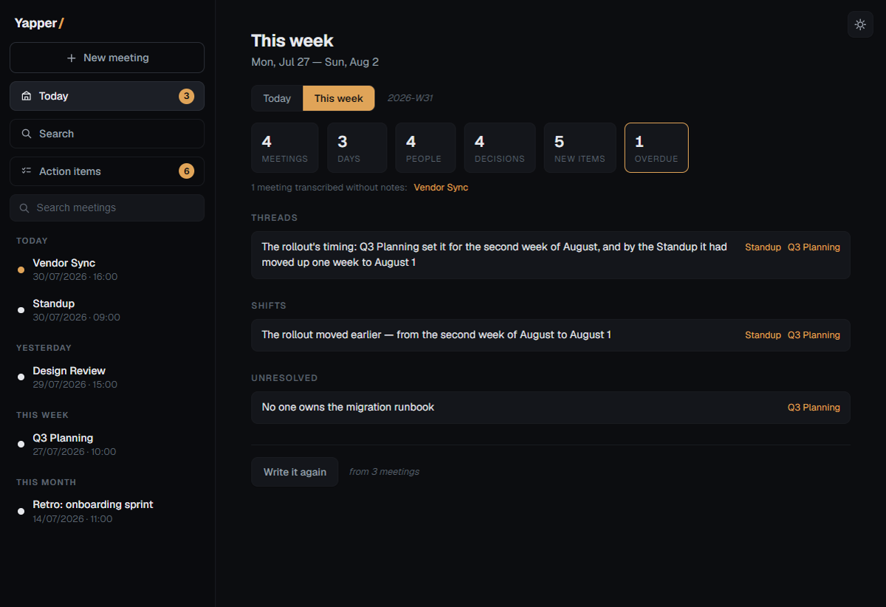

# Yapper — user manual and honest assessment

Yapper records meetings on Windows and macOS, transcribes them **on the machine** with
whisper.cpp, and writes structured notes with an LLM the user chooses. Nothing
is uploaded to record or transcribe; every meeting is a plain folder of files
the user can open. It is a working clone of the another meeting-notes app idea with a different
architecture underneath — local-first instead of cloud — and this document
describes both what it does well and what it does not do yet, without
decoration, so the gaps can be planned rather than discovered.

For internals — module map, IPC surface, measured performance, the reasoning
behind each decision — see [ARCHITECTURE.md](../ARCHITECTURE.md). This document
is about using it and judging it.

---

## 1. Install and first run

**For users: an installer.**

> Download: **https://github.com/iamchuck504/yapper-releases/releases/latest**
> (the code repo stays private; that public repo hosts only installers and the
> update feed)

`Yapper-Setup-<version>.exe` (~83 MB) installs
per-user — no admin rights — creates the shortcuts, and on first launch the app
downloads the transcription engine itself, with progress on screen: ~650 MB on
a CPU-only machine, ~1.3 GB when an NVIDIA GPU is detected (the CUDA build).
Recording stays disabled until that lands. Installed copies then **keep
themselves updated** from the release feed: checked at launch and every four
hours, downloaded in the background, applied on quit — or immediately via the
"Update ready — restart" pill in the sidebar. The whole loop is exercised by
`build/e2e-update.ps1`, which installs a 0.1.0, serves it a 0.1.1, and checks
that what is on disk afterwards is 0.1.1.

Two honest caveats. The installer is **not code-signed** — no certificate — so
SmartScreen shows "Windows protected your PC" and the user has to click
*More info → Run anyway* once. And the update feed lives on GitHub Releases,
so the machine needs to reach github.com.

**For development: from source.**

```powershell
git clone https://github.com/iamchuck504/yapper
cd yapper
npm install          # electron + electron-builder + electron-updater
.\setup.ps1          # downloads whisper.cpp + models next to the code
npm start            # run;  npm run dist builds the installer
```

On first run the app plays an 11-second real-speech sample through the
transcription engine and **measures the machine** instead of guessing:

| Tier | Measured pass | Live transcript | Final pass model |
|---|---|---|---|
| `fast` | ≤ 250 ms | yes — updates every 0.7 s | `small` |
| `steady` | ≤ 1200 ms | yes — every 2 s | `small` |
| `modest` | slower | **none** — transcript arrives after the meeting | `small` |

Measured anchors: an RTX 4080 lands at ~75 ms (`fast`); an i7-12700K on CPU
alone lands at ~736 ms (`steady`). A machine without a capable CPU/GPU still
records and transcribes — it just has no live text during the meeting.

**Notes need a provider.** The default is the Claude Code CLI if the machine is
signed into one (no key, no per-meeting cost). Otherwise: Google Gemini (free
tier, no card), OpenRouter, Ollama (fully local), the Anthropic API, or any
OpenAI-compatible endpoint. Keys are sealed with the OS keystore (DPAPI on
Windows) — the settings file never contains a readable key.

---

## 2. Using Yapper

### The day starts on Today



The app opens on **Today**: the meetings recorded today, what they decided, the
action items they produced, and what needs attention — a meeting that was
transcribed but never summarized, an overdue task, something marked urgent.
Every line on this screen is a copy of something written in a note file, with a
link back to the meeting it came from. No model is involved; it is instant and
it cannot say anything that is not on disk.

### Recording a meeting



**New meeting** is where a recording starts. Before it does, the options that
shape the notes: seven note styles (General, Minutes, Memo, Stand-up, 1:1,
Client call, Brainstorm), a detail level, mic noise reduction, participants
(used to spell names correctly — the app does not detect who is present), and
free-form instructions. The provider selector lives here too.



While recording: live waveforms for system audio and the microphone with
per-channel gain, a timer, **Mark** to flag a moment, **Pause**, and the live
transcript panel. Audio is written to disk as it arrives — a crash or power
cut leaves a playable file, and the app repairs its header on next launch.

If the microphone delivers pure digital silence (a wireless headset that fell
asleep, a hardware mute), the app says so on screen within seconds instead of
letting a two-hour meeting record as nothing.

### The capsule


While recording, an always-on-top capsule shows the audio level and the clock —
the level bars move with the real signal, so motion means audio is actually
being captured. Hovering it opens the live transcript and the controls:



Leave and it shrinks back; the pin keeps it open. The live transcript shows
confirmed text in white and the still-changing tail in grey — words are only
promoted once two consecutive passes agree on them (median 2.6 s behind speech
on a `fast` machine, worst measured 4.8 s).

### Meeting detection



Yapper watches which app is using the microphone (Zoom, Teams, Slack, Discord,
Webex, or a browser call) and offers to take notes — as this card over
whichever view is open, and as a Windows notification for when Yapper is not
the focused window. It never starts recording on its own, and the card
deliberately does not switch views.

Honest limits of this mechanism: it knows *an app is using the microphone*,
not that a meeting exists. It cannot tell a Meet call from any other tab using
the mic in a browser, and it knows no titles or attendees — there is no
calendar integration.

### After the meeting: transcript, then notes



Stop, and the pipeline runs: full transcription (windowed, so memory stays
flat), then notes, then an auto-title. A two-hour meeting takes about **115
seconds to transcribe and 73 seconds to summarize** on an RTX 4080 — measured,
not estimated. Notes are grouped into colored sections with timestamps back
into the transcript, editable in place, regenerable in any style, exportable as
Markdown, plain text, or PDF, and readable aloud. The full transcript is always
there under the notes, and exports as Markdown too.

**The audio's job ends with the transcript.** Once a real transcript exists,
the recording is deleted — the transcript is the record. A per-meeting toggle
(off by default, resets every session) keeps one meeting's audio when that is
wanted. This is the same posture another meeting-notes app takes, and it is the reason a year of
meetings costs megabytes, not gigabytes.

### Action items



Every meeting's action items are collected into one list, with owner, due date
and priority — **only when those were actually said**. A blank owner means
nobody was named; the app never guesses. `URGENT:` is understood as a priority
label, not a person. The same task restated in a later meeting folds into the
existing entry instead of duplicating, and every item links to the meetings it
came from.

### Search and Ask



One box does both. Words, names, dates ("what happened in June", "last week" —
English and Spanish) filter and rank passages from every note and transcript.
A question gets an answer written **only from the retrieved passages**, with a
citation on every claim; if nothing relevant exists, it says so instead of
answering. Search is local, instant, and needs no provider; only the written
answer uses one.

### This week



The weekly view has two layers. The numbers — meetings, days, people,
decisions, new items, overdue — are assembled from the notes and never involve
a model, so they survive any provider failure. The written part below is the
one place a model is asked for something assembly cannot produce: threads that
ran through several meetings, where the week changed direction, what was left
unresolved. Every bullet must cite the meetings it came from, and **a bullet
citing a meeting that does not exist is discarded by code**, with the discard
counted on screen. It is cached per week and regenerates when any meeting in
the week changes.

### Importing a voice note

**Import voice note** takes an existing audio file (m4a, webm, mp3, wav —
anything Chromium can decode), converts it, and runs the same pipeline:
transcript, notes, title. Useful for phone recordings and voice memos.

---

## 3. What exists today — inventory

| Area | State |
|---|---|
| Record system audio + mic | Working on both (Windows loopback; macOS ScreenCaptureKit helper, needs Screen Recording) |
| Live transcript | Working on `fast`/`steady` machines; absent on `modest` |
| Full transcription | Working, local, ~63× real time on a 4080 |
| Notes in 7 styles + custom instructions | Working, provider-dependent |
| Auto-title, participants, markers | Working |
| Import audio files | Working |
| Today digest / This week review | Working |
| Action items across meetings | Working |
| Search + grounded Q&A | Working |
| Exports (MD, TXT, PDF, transcript MD) | Working |
| Meeting auto-detection + notification | Working, heuristic (mic usage) |
| Audio auto-release after transcript | Working, with per-meeting keep toggle |
| BYOK providers + OS-keystore key storage | Working (6 providers) |
| Dark/light theme, read-aloud, start at login | Working |
| Windows installer (per-user NSIS) | Working, unsigned |
| macOS build (dmg + zip, arm64) | Working, ad-hoc signed, **not notarised** |
| First-run engine download with progress | Working |
| Auto-update from the release feed | Working, proven end to end (Windows; on macOS it notifies and links the download) |
| macOS | Working: Metal engine, system audio, meeting detection, notifications. Apple Silicon only, unsigned |
| Mobile | **Missing** |
| Speaker labels | **Missing** |
| Calendar integration | **Missing** |
| Sync, sharing, team features | **Missing** |

Testing: ~30 scripted checks-suites — pure logic in `npm test` (seconds), plus
Electron-driven suites that operate the real window, feed real audio through
the real IPC, and include fault injection, a measured two-hour meeting, and
adversarial key-leak tests. `build/` also carries probes that diagnose rather
than assert (empty profile, notifications, dead waveforms).

---

## 4. Weaknesses, without decoration

These are the true costs of the current build. None of them is hidden by the
UI; several are deliberate trade-offs, marked as such.

1. **The installer is unsigned.** A code-signing certificate costs money and
   identity paperwork; without one, SmartScreen warns on first install and some
   corporate policies block unsigned executables outright. The auto-updater
   works unsigned, but signing is what "install without a scary screen" costs.
2. **macOS works, but is not signed.** Recording both sides, meeting detection,
   notifications and the Metal engine all run there now — the first build was
   done on an M4 Pro and the gaps that mattered were closed: system audio comes
   from a ScreenCaptureKit helper rather than the Windows-only loopback, and
   detection asks CoreAudio instead of the registry. What is left all traces
   back to one missing thing, an Apple Developer certificate: Gatekeeper asks
   on first open, updates notify instead of self-installing, and there is no
   notarised installer to hand someone. System audio also depends on the user
   granting Screen Recording; refused, it records the microphone alone and says
   so. Apple Silicon only. No mobile.
3. **No speaker labels.** The transcript does not say who spoke. Typed
   participants improve name spelling only. (The mic and system channels are
   already separate internally, so "You:" vs "Them:" attribution is reachable —
   see §7 — but today it does not exist.)
4. **Transcription ceiling is whisper `small`.** On clean audio it is very
   good; a managed cloud ASR pipeline is generally stronger on heavy accents,
   crosstalk and bad microphones. `medium` was measured against `small` on real
   meeting audio and bought nothing (same word error profile, 3× slower), so
   the ceiling is real, not a configuration mistake.
5. **Live transcript needs hardware.** On a machine that measures `modest`,
   there is no live text at all — the transcript arrives after the meeting.
6. **Notes require an external LLM** unless Ollama is installed. With any
   cloud provider (including the Claude CLI), the *transcript text* leaves the
   machine at summarization time. Audio never does. Users who need the whole
   pipeline local must run Ollama, and small local models write noticeably
   weaker notes.
7. **Search is lexical.** BM25 finds words, not meanings — "cost" does not
   find "pricing". Deliberate for now (no index to build, works offline,
   instant), but it is a real quality gap against semantic search.
8. **Auto-detection is a heuristic.** Mic usage says "some app opened the
   microphone", nothing more. No titles, no attendees, no schedule — because
   there is no calendar integration.
9. **One machine, one user.** No sync, no backup beyond the user's own, no
   sharing links, no team workspace, no API, no mobile capture. Sharing today
   means exporting a file.
10. **Audio is gone after transcription** (by design). If a transcript came
    out bad and the keep-toggle was off, there is no second chance at that
    audio. The transcript-quality bar is what makes this bet acceptable.
11. **Windows notifications carry no buttons** (Electron limitation) — the
    whole toast is the click target.
12. **Updates depend on the release feed being maintained.** Installed copies
    update themselves, but only from versions somebody actually published
    (`npm run release`); a development checkout still updates with `git pull`.
13. **UI is English only.**
14. **The transcript is not editable in-app.** Notes are; the transcript file
    must be edited externally if a word is wrong.
15. **No compliance posture.** There is no SOC 2, no GDPR paperwork, no audit
    trail. For a company evaluating tools formally, this is a checkbox Yapper
    cannot tick — even though architecturally less data leaves the machine
    than with any cloud tool.
16. **Maintainability debt:** the renderer is one 2,500-line file. Organized
    and documented, but it is the file every UI change touches.
17. **One real-world user so far.** The automated suites are extensive, but
    the product has not survived contact with a fleet of strangers' machines,
    drivers and habits.

---

## 5. Yapper vs another meeting-notes app

another meeting-notes app facts below are from another meeting-notes app's own security documentation and 2026
reviews (sources at the end); worth re-verifying at decision time since the
product moves fast.

The philosophical difference, one line: **another meeting-notes app is a cloud service with a
local capture client; Yapper is a local application, full stop.**

| | Yapper | another meeting-notes app |
|---|---|---|
| Capture | System audio + mic, no bot in the call | Same approach, no bot |
| Transcription | **On the machine** (whisper.cpp) | **In the cloud** (audio flows to Deepgram/AssemblyAI/OpenAI, deleted after) |
| Audio retention | Deleted after transcript; per-meeting keep toggle | Deleted after transcription |
| Where notes live | Plain files in `Documents\Meetings` | AWS-hosted cloud (encrypted), synced |
| Notes LLM | User's choice: Claude CLI, Gemini free, OpenRouter, Ollama (local), Anthropic, any compatible | Managed (GPT-4o / Claude) |
| Speaker separation | None | Two-speaker (you vs. others) |
| Calendar | None | Integrated (meetings, titles, upcoming) |
| Platforms | Windows | macOS, Windows, iOS |
| Sharing / teams | None | Links, workspaces, Notion/HubSpot/Slack/Zapier, API (Enterprise) |
| Account | None | Required |
| History limit | None — it is the user's disk | Free plan capped at 25 meetings |
| Price | $0 + optional BYOK usage | Free (capped) / $14 / $35 per user/month |
| Offline | Record + transcribe fully offline | Needs the cloud to transcribe |
| Code | Owned, modifiable, tested | Closed |

### Where Yapper is genuinely ahead

1. **Audio never leaves the machine.** another meeting-notes app's own docs describe audio
   flowing through third-party ASR services (then deleted). Yapper's never
   goes anywhere. With Ollama, even the transcript text stays local — a fully
   offline pipeline no cloud product can offer.
2. **Data ownership.** A meeting is a folder: `transcript.txt`, `notes.md`.
   Grep it, back it up, leave the product with everything. No account, no
   25-meeting cap, no export request.
3. **Cost structure.** $0 for the app; notes cost whatever the chosen provider
   costs, including free (Gemini tier, an existing Claude subscription, or
   Ollama). another meeting-notes app's real use starts at $14/user/month.
4. **Grounding enforced by code, not prompts.** Across the app, "nothing
   invented" is mechanical: an action item's owner exists only if written
   (`URGENT:` is not a person), a due date only if a date was said, the weekly
   review drops any bullet citing a meeting that is not there, and Ask answers
   only from retrieved passages, cited, or refuses. Cloud tools promise this
   in prompts; Yapper also enforces it after the model responds.
5. **Adaptation is measured, not assumed** — the calibration tier system, the
   silence watchdog, the honest empty states. The app states what it cannot do
   on this machine instead of degrading silently.
6. **The team owns the code** and the test harness, and the architecture is
   documented at decision level (ARCHITECTURE.md).

### Where another meeting-notes app is genuinely ahead

1. **It installs without a warning.** Both now install and self-update, but
   another meeting-notes app's binaries are code-signed and notarized; Yapper's installer trips
   SmartScreen until it is signed, and Yapper's first run still downloads the
   engine where another meeting-notes app is ready immediately.
2. **Platforms and sync.** Mac + Windows + iPhone, notes following the user.
   Yapper is one Windows machine.
3. **Speaker attribution.** "You said / they said" changes how useful a
   transcript is, and Yapper has none of it.
4. **Calendar awareness.** another meeting-notes app knows a meeting is coming, its title and
   attendees. Yapper notices a microphone in use.
5. **Transcription robustness on hard audio.** Managed cloud ASR handles
   accents, crosstalk and bad mics better than a local `small` model.
6. **Collaboration is a product**: share links, team workspaces, CRM/Notion/
   Slack integrations, an API tier. Yapper exports files.
7. **Maturity**: onboarding, auto-updates, support, SOC 2 / GDPR posture, and
   the polish of thousands of users' feedback. Yapper has one user and a test
   suite.

---

## 6. What closing the gaps would need

Neutral estimates of shape, not commitments; ordered by leverage.

- ~~Installer~~ — **done**: NSIS per-user installer, first-run engine download.
- ~~Auto-update~~ — **done**: electron-updater against the release feed, the
  full loop proven by `build/e2e-update.ps1`.
- **Code signing** — a certificate (or Azure Trusted Signing) to stop the
  SmartScreen warning; now the highest-leverage item for sharing.
- **"You vs Them" speaker attribution** — mic and system audio already travel
  on separate buses internally; recording them as two channels (or two files)
  and tagging transcript segments by channel would deliver the 80% case
  without diarization models.
- **Calendar integration** — Google/Microsoft OAuth, read-only calendar scope;
  would turn detection from "a mic is in use" into "the 10:00 with Ana is
  starting", with titles and attendees prefilled.
- **Semantic search** — a small local embedding model beside BM25, keeping the
  no-cloud promise while closing the synonym gap.
- **macOS notarization** — the Metal build and the ScreenCaptureKit capture are
  done; what remains is the Apple Developer certificate, which is also what
  unlocks self-installing updates there.
- **True diarization** — heavier (tinydiarize / pyannote class models); the
  channel split above is the cheap first step.
- **Renderer split** — mechanical refactor of the 2,500-line file into
  modules; no user-visible change, pays down the maintenance cost.

---

## 7. Sources for the another meeting-notes app comparison

- [another meeting-notes app — Security](https://www.another meeting-notes app.ai/security) and
  [Security, Privacy & Data FAQs](https://docs.another meeting-notes app.ai/help-center/consent-security-privacy/security-privacy-data-faqs)
  (audio to Deepgram/AssemblyAI/OpenAI, deleted after; notes in AWS; no bot)
- [another meeting-notes app — Local-first vs cloud](https://www.another meeting-notes app.ai/blog/local-first-ai-notetaker-vs-cloud)
- [another meeting-notes app AI Pricing 2026 — free plan's 25-note cap](https://get-alfred.ai/blog/another meeting-notes app-pricing)
- [another meeting-notes app AI Review 2026 — Efficient App](https://efficient.app/apps/another meeting-notes app),
  [work-management.org review](https://work-management.org/productivity-tools/another meeting-notes app-ai-review/),
  [skillscouter review](https://skillscouter.com/another meeting-notes app-review/)
  (features, tiers at $14/$35, iOS app, two-speaker detection, GPT-4o/Claude)

All screenshots in this manual are real captures of the current build against
demo data, regenerable with `build\shoot-manual.js`.
